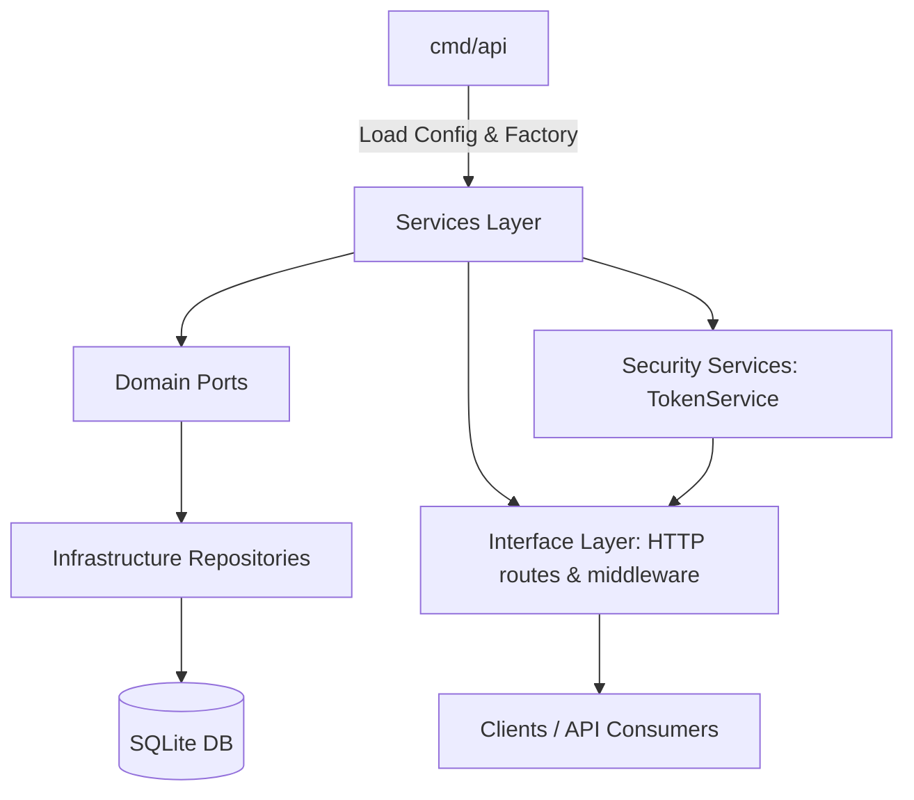
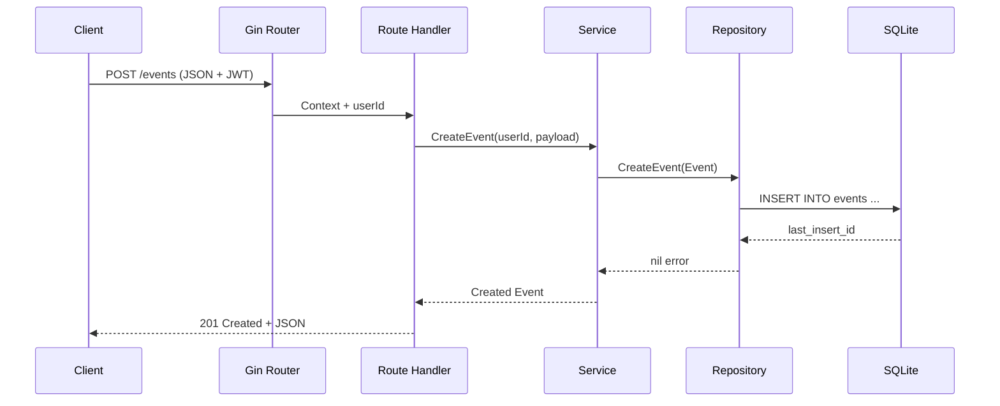

# Go REST API – Event Management Platform

A clean-architecture REST API written in Go that enables user management, event publishing, and attendee registrations. The project separates concerns across domain, infrastructure, services, and interface layers, emphasizing testability, clear boundaries, and ergonomic developer tooling.

---

## Table of Contents
1. [Functional Overview](#functional-overview)
2. [Technical Architecture](#technical-architecture)
   - [Layered View (Mermaid Diagram)](#layered-view-mermaid-diagram)
   - [Request Lifecycle](#request-lifecycle)
3. [Key Modules](#key-modules)
4. [Configuration & Environment](#configuration--environment)
5. [Running Locally](#running-locally)
6. [Testing & Tooling](#testing--tooling)
7. [Development Workflow](#development-workflow)
8. [Extending the System](#extending-the-system)

---

## Functional Overview

- **User Management**  
  - Signup (email/password) with bcrypt hashing  
  - Login issuing JWT tokens for authenticated operations

- **Event Lifecycle**  
  - CRUD operations scoped per organizer (ownership enforced)  
  - Event metadata: name, description, location, date/time

- **Registrations**  
  - Authenticated users can register/cancel for events  
  - Conflict handling (already registered) and validation (not registered yet)

- **Security**  
  - JWT-based authentication  
  - Gin middleware that injects `userId` into request context after token verification

- **Persistence**  
  - SQLite (easily swappable) with on-start schema creation  
  - Repository layer encapsulating SQL and returning domain-aware errors

---

## Technical Architecture

- **Language:** Go 1.26.x
- **Framework:** Gin for HTTP server & routing
- **Storage:** SQLite (via `database/sql` + `mattn/go-sqlite3`)
- **Auth:** `golang-jwt/jwt/v5`
- **Validation:** `gin` binding + explicit business rules
- **Error Modeling:** Custom `pkg/errs` with typed errors and consistent translations to HTTP responses

### Layered View (Mermaid Diagram)



- **cmd/api**: entry point; wires configuration, DB, repositories, services, and HTTP handlers.
- **Services Layer**: business use cases (events, users, registrations) orchestrating repositories and error semantics.
- **Domain Ports**: interfaces describing persistence contracts; repositories conform to them.
- **Infrastructure Repositories**: concrete SQL interactions; return `errs.AppError`.
- **Interface Layer**: Gin routes/middlewares; handle request parsing, error translation, and response formatting.

### Request Lifecycle



---

## Key Modules

| Module | Description |
| --- | --- |
| `cmd/api/config` | Loads environment variables via `envconfig` (port, DB, JWT secret, etc.) |
| `cmd/api/factory` | Dependency injection: initializes DB connection, repositories, token service, and use cases |
| `pkg/errs` | Domain-level error modeling with typed helpers and `Is` support |
| `pkg/crypto` | Password hashing and verification helpers (bcrypt) |
| `src/domain/ports` | Interfaces for repositories (events, users, registrations) ensuring services remain decoupled |
| `src/infrastructure/db` | Connection factory + auto-migration for SQLite tables |
| `src/infrastructure/repositories` | SQL implementations of domain ports; only data access logic resides here |
| `src/services` | Business use cases (`EventService`, `UserService`, `RegistrationService`, `TokenService`) |
| `src/interface/http` | Gin routes, helpers, and middleware bridging HTTP to services |
| `test/mocks` | Generated gomock artifacts for all service and repository interfaces used by tests |

---

## Configuration & Environment

Environment variables are parsed by `envconfig` with sensible defaults:

| Variable | Description | Default |
| --- | --- | --- |
| `SERVER_PORT` | HTTP port | `8080` |
| `DB_DRIVER` | Database driver | `sqlite3` |
| `DB_DSN` | Database file/DSN | `api.db` |
| `DB_MAX_OPEN_CONNS` | Connection pool size | `10` |
| `DB_MAX_IDLE_CONNS` | Idle connections | `5` |
| `JWT_SECRET` | Symmetric signing secret | `secret` |
| `JWT_EXPIRATION` | Token lifetime | `1h` |

Define these in your shell or a `.env` file before running the API.

---

## Running Locally

```bash
# Install dependencies
go mod tidy

# Start the API
make api   # runs `/usr/local/go/bin/go run ./cmd/api`

# The server listens on :8080 by default
```

Sample HTTP flows can be tested using the `.http` files under `/http`.
JWT-protected endpoints require the `Authorization` header populated with the token returned from `/login`.

---

## Testing & Tooling

- **Unit Tests:** `make test` runs `/usr/local/go/bin/go test ./...` across all packages, including HTTP handlers and services using gomock-generated doubles.
- **Mocks Regeneration:** `make mocks` regenerates all gomock files in `test/mocks/` for repository and service interfaces.
- **Coverage Targets:** Services, routes, crypto, and error packages already have suites; extend them as new features arrive.

---

## Development Workflow

1. **Update Interfaces**: Modify or add domain ports under `src/domain/ports`.
2. **Regenerate Mocks**: `make mocks` to keep gomock artifacts current.
3. **Implement Repositories**: Add SQL logic under `src/infrastructure/repositories`.
4. **Add Use Cases**: Extend services for new business rules and expose them through the HTTP layer.
5. **Add Routes**: Map new endpoints in `src/interface/http/routes`, keeping JSON parsing and error handling centralized.
6. **Test Continuously**: `make test` before pushing changes; use gomock for isolated service/handler tests.

---

## Extending the System

- **Database Swap**: Replace SQLite DSN and driver in `cmd/api/config/env.go`. Repositories rely only on `*sql.DB`; no interface changes required.
- **New Modules**: Follow the existing pattern—define a port, implement repository/service, expose routes/middleware.
- **Deployment**: Containerize using a multi-stage Dockerfile (not yet provided) or run inside managed environments; environment variables keep configuration flexible.
- **Observability**: Plug logging/metering at the service layer; `errs.AppError` makes mapping telemetry straightforward.
